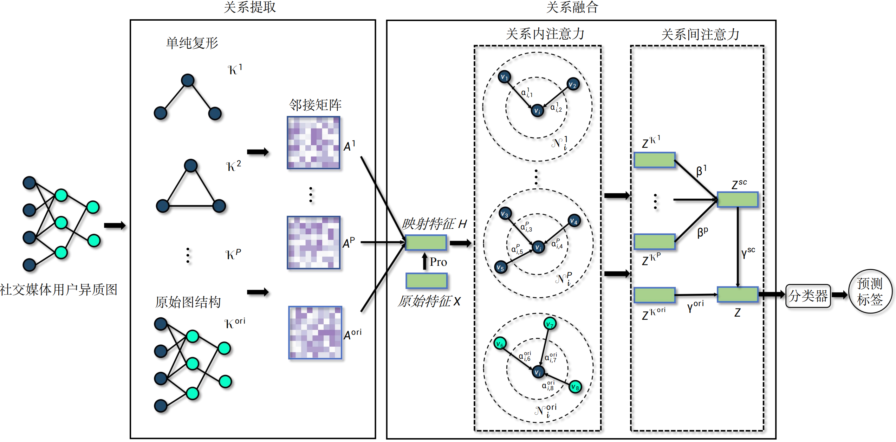
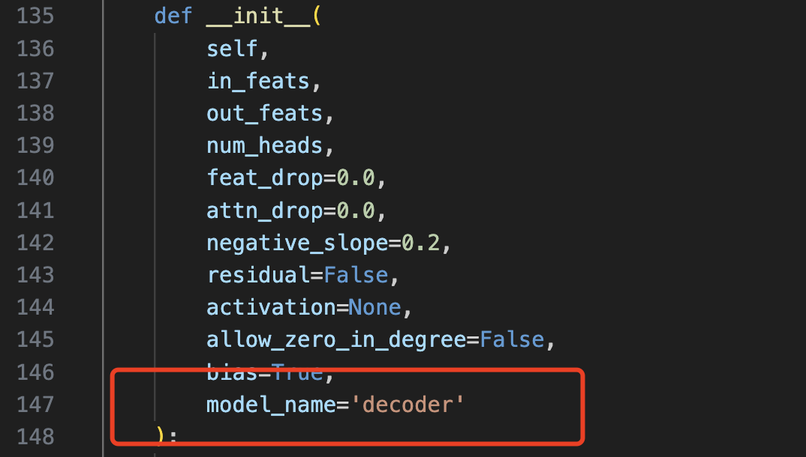
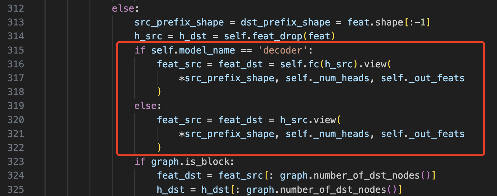

# Simplicial Hyperbolic Attention Network
This is the source code of CIKM-2023 paper: Multi-Order Relations Hyperbolic Fusion for Heterogeneous  Graphs

The source code is based on [HGCN](https://github.com/HazyResearch/hgcn)

## Get Started
### Requirements
- dgl==2.2.1
- torch==2.2.2
- torch_geometric==2.5.2
- torch-scatter==2.1.2
- torch-sparse==0.6.18
### Datasets
```bash
mkdir data
cd data
```
We use datasets (ACM, IMDB, DBLP) from [Graph Transformer Networks](https://github.com/seongjunyun/Graph_Transformer_Networks/tree/master). Download and extract [data.zip](https://drive.google.com/file/d/1Nx74tgz_-BDlqaFO75eQG6IkndzI92j4/view) into data folder.
### Message Aggregation
We adapted DGL's [GATConv](https://docs.dgl.ai/generated/dgl.nn.pytorch.conv.GATConv.html) to implement message aggregation in SHAN.
1. Add `model_name='decoder'` to the parameters of the `__init__` function in `GATConv`.

2. In the `forward` function of `GATConv`, change 

    ```python
    feat_src = feat_dst = self.fc(h_src).view(
        *src_prefix_shape, self._num_heads, self._out_feats
    )
    ```

    to

    ```python
    if self.model_name == 'decoder':
        feat_src = feat_dst = self.fc(h_src).view(
            *src_prefix_shape, self._num_heads, self._out_feats
    else:
        feat_src = feat_dst = h_src.view(
            *src_prefix_shape, self._num_heads, self._out_feats
        )
        )
    ```

### Run
```bash
cd src
```
- ACM
```bash
python main.py --dataset acm --decoder linear
```
- IMDB
```bash
python main.py --dataset imdb --decoder gat
```
- DBLP
```bash
python main.py --dataset dblp --decoder gat --K 1 --decoder_residual 0 --sample_times 2
```
## Citation
If this work is useful for your research, please cite our work:
```
@inproceedings{10.1145/3583780.3614979,
author = {Li, Junlin and Sun, Yueheng and Shao, Minglai},
title = {Multi-Order Relations Hyperbolic Fusion for Heterogeneous Graphs},
year = {2023},
booktitle = {Proceedings of the 32nd ACM International Conference on Information and Knowledge Management}
}
```
